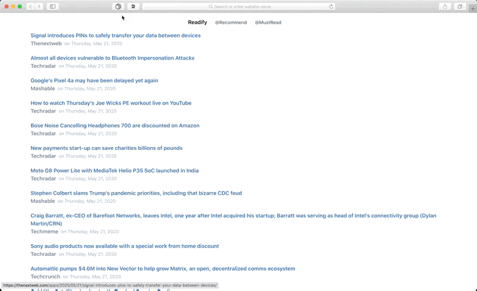
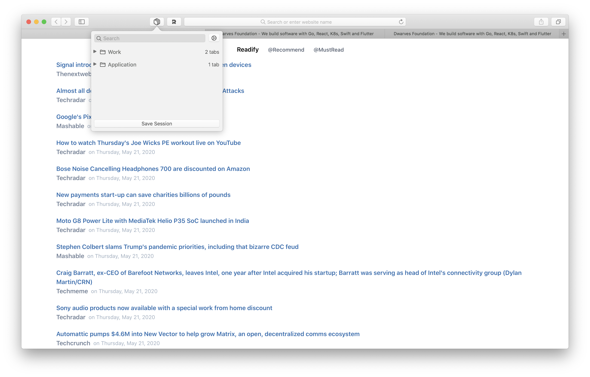

	

<a href="https://github.com/dwarvesf/session-buddy/releases/latest">
 		
	
	

## Session Buddy

A ultra-light Safari extension helps you save open tabs as collections that can be easily restored later. Tired of having too many tabs open, and you guys are too "FOMO" to close all of them? Session Buddy came to the rescue 👍

	

## 🚀 Install

###  App Store

### Others

The Session Buddy is notarized before distributed out side App Store. It's safe to use 👍

#### Manual download

- [Download latest version](https://github.com/dwarvesf/session-buddy/releases/latest)
- Unzip and drag the app to the Applications folder
- Right click and press open in context menu to open app

## 🕹 Usage

- Open the app
- Safari > Preferences > Extension Panel > Check the checkbox next to the Session Buddy > Good to go
- Click to the little toolbar button next to your address bar to start using the app

	
	

## ✨<a href="https://github.com/dwarvesf/session-buddy/graphs/contributors">Contributors</a>

This project exists thanks to all the people who contribute. Thank you guys so much 👏

Please read [this](CONTRIBUTING.md) before you make a contribution.

## Requirements
macOS version >= 10.12

## You may also like
- [Hidden Bar](https://github.com/dwarvesf/hidden) - An ultra-light MacOS utility that helps hide menu bar icons
- [Blurred](https://github.com/dwarvesf/blurred) - A macOS utility that helps reduce distraction by dimming your inactive noise
- [Micro Sniff](https://github.com/dwarvesf/micro-sniff) - An ultra-light macOS utility that notify whenever your micro-device is being used
- [VimMotion](https://github.com/dwarvesf/VimMotionApp) - Access macOS UI elements with your fingers stay on keyboard. Inspired by vim-easymotion & avy-mode.

## License

MIT &copy; [Dwarves Foundation](https://github.com/dwarvesf)
